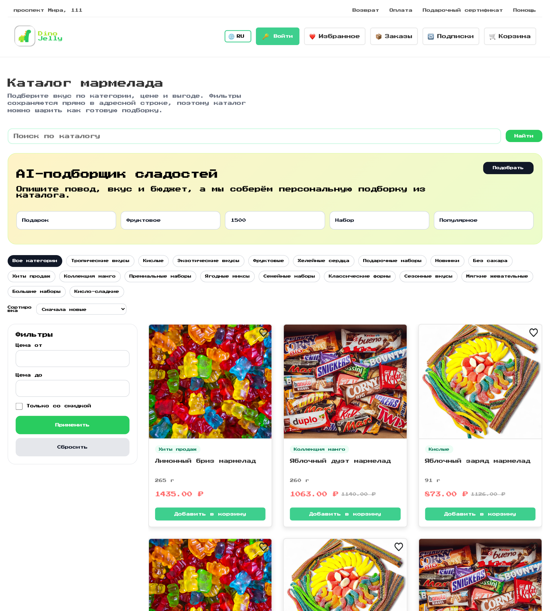
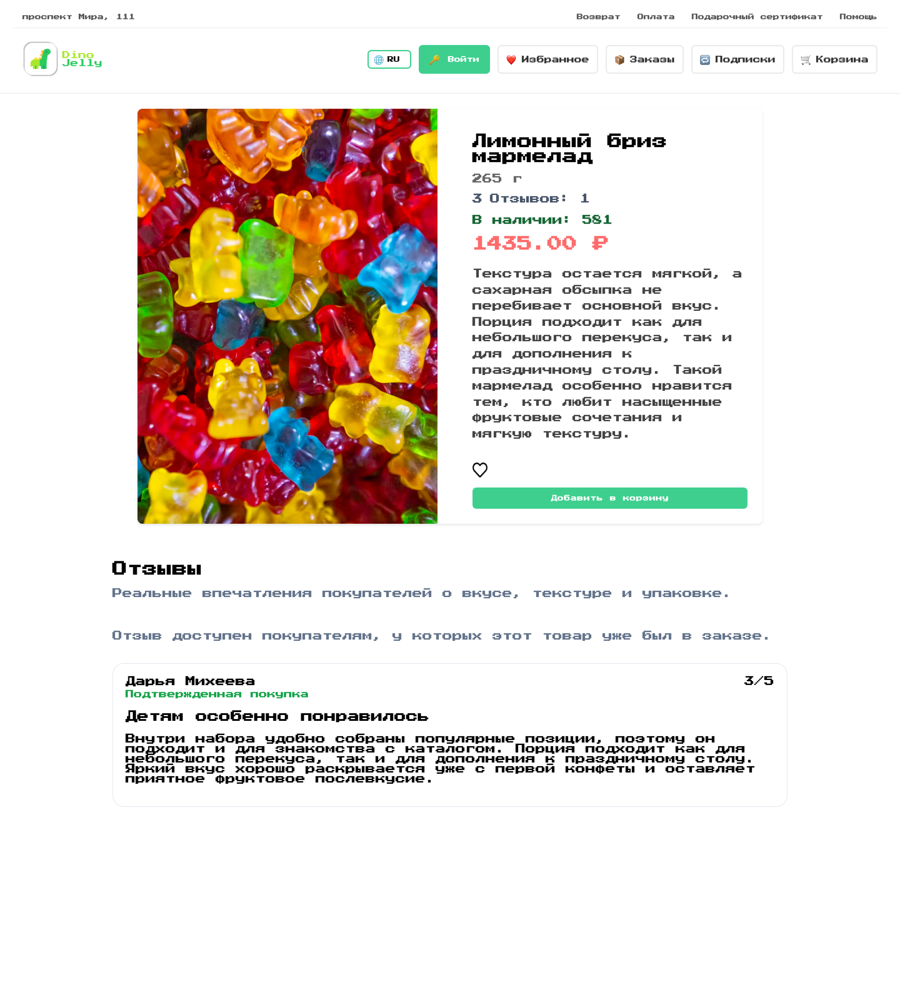
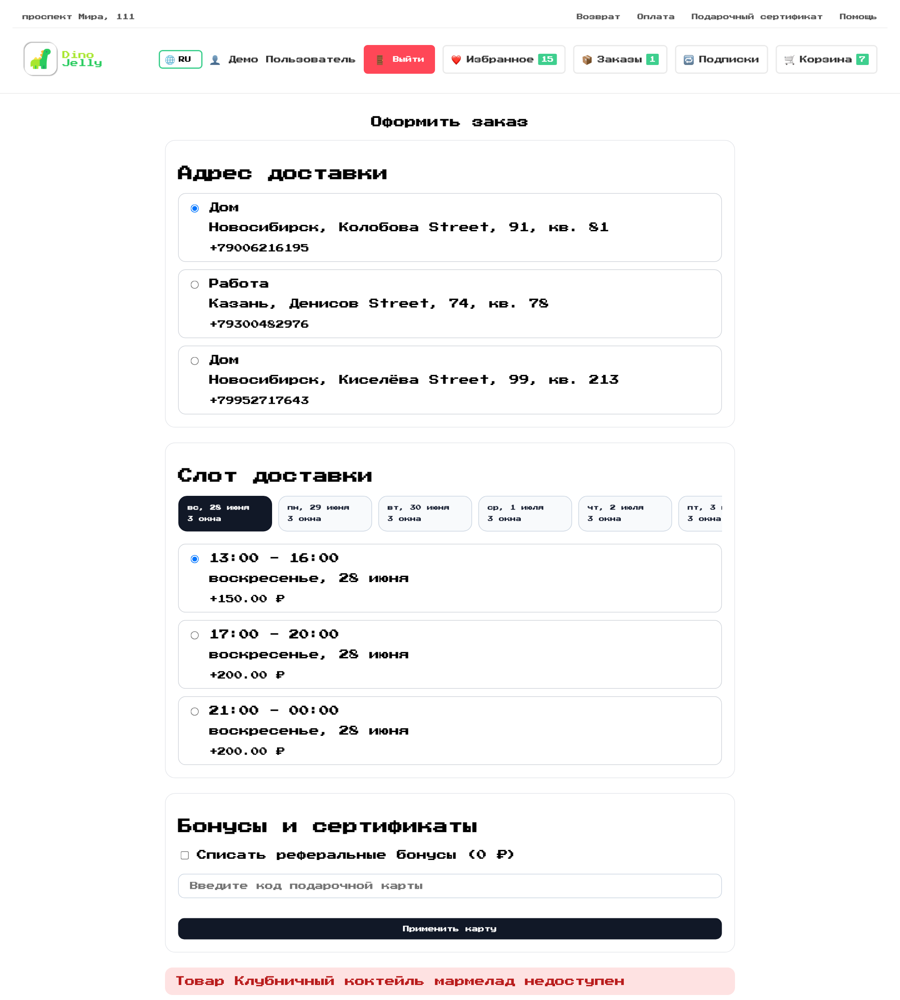
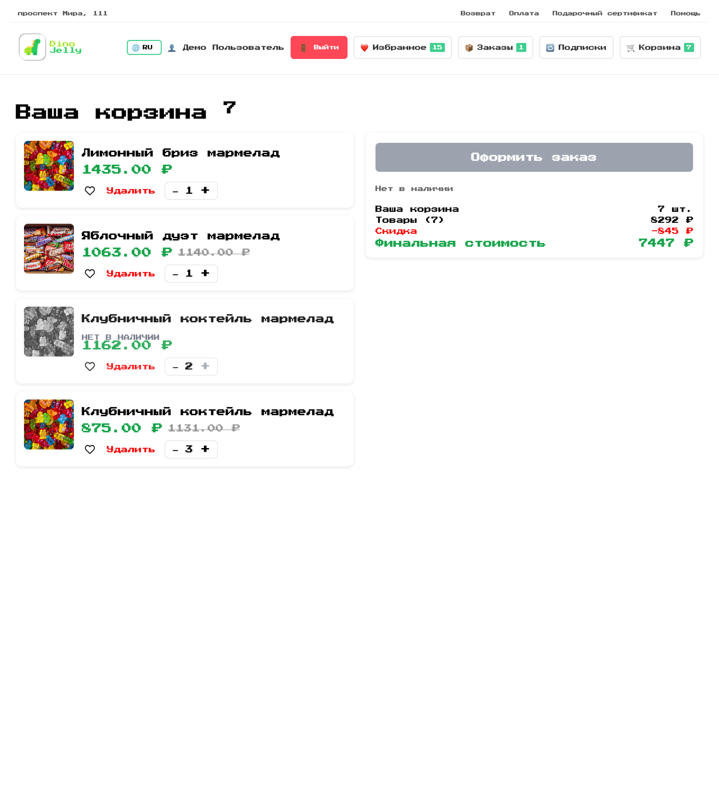
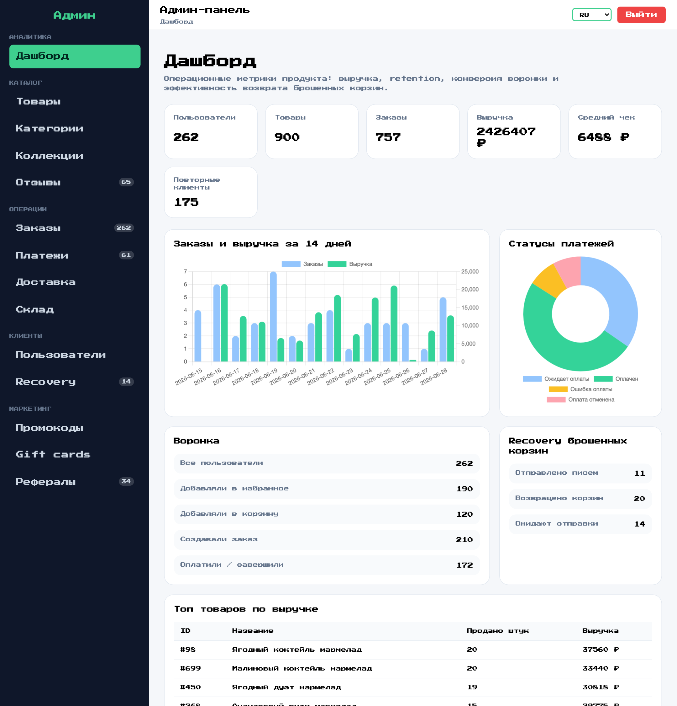

# DinoJelly

Коммерческий demo storefront для интернет-магазина мармелада на `Laravel + Inertia + Vue`.

DinoJelly показывает полный e-commerce цикл: каталог, карточки товаров, избранное, корзину, checkout, заказы, подписки, промокоды, gift cards, referral-механику и отдельную админ-панель с операционной аналитикой.

## Showcase

<p align="center">
  
</p>

<table>
  <tr>
    <td width="50%">
      
    </td>
    <td width="50%">
      
    </td>
  </tr>
  <tr>
    <td width="50%">
      
    </td>
    <td width="50%">
      
    </td>
  </tr>
</table>

## Product Scope

- Витрина каталога с категориями, поиском, сортировкой и фильтрами.
- AI-подборщик сладостей по сценарию покупки, вкусу и бюджету.
- Карточки товаров с отзывами, рейтингами и контролем остатков.
- Избранное, корзина, delivery slots и checkout с бонусами и gift cards.
- Личный кабинет с заказами, подписками и повторными покупками.
- Admin dashboard с выручкой, заказами, recovery и топ-товарами.

## Stack

- `Laravel 10`
- `PHP 8.2`
- `Vue 3`
- `Inertia.js`
- `Vite`
- `MySQL 8`
- `Redis`
- `Docker Compose`

## Quick Start

### Development

```bash
cp .env.example .env
docker compose -f docker-compose.dev.yml up -d --build
docker compose -f docker-compose.dev.yml exec app composer install
docker compose -f docker-compose.dev.yml exec app php artisan migrate:fresh --seed
```

Локальные адреса:

- storefront: `http://localhost:8000`
- vite: `http://localhost:5173`
- adminer: `http://localhost:8080`

### Production-like

```bash
docker compose up -d --build
```

## Demo Accounts

- customer: `demo@dinojelly.local` / `password`
- admin: `admin@dinojelly.local` / `password`

## Screenshots

README-скриншоты снимаются локально из работающего docker-стека:

```bash
node scripts/capture-readme-screenshots.mjs
```

Файлы сохраняются в `docs/screenshots/`.
